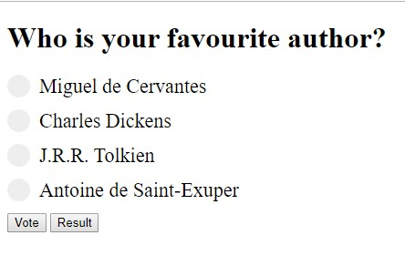
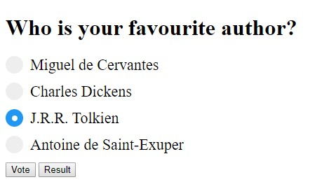
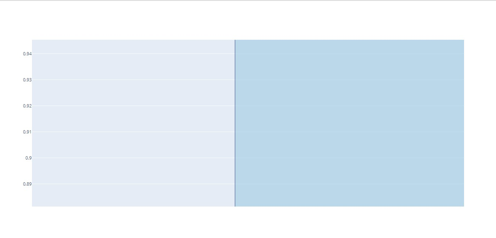

# Polling-Application

Flask and MongoDB integration to create a real time interaction application.

## Requirements

- plotply
- pymongo
- chart_studio

> Python version > 3.0

## How to run

- Clone the repo
- Type

```shell
    pipenv sync
```

- After successful completion, type

```shell
    pipenv run python poll.py
```

## Output

- Select Options



- Selected Option



- Result


